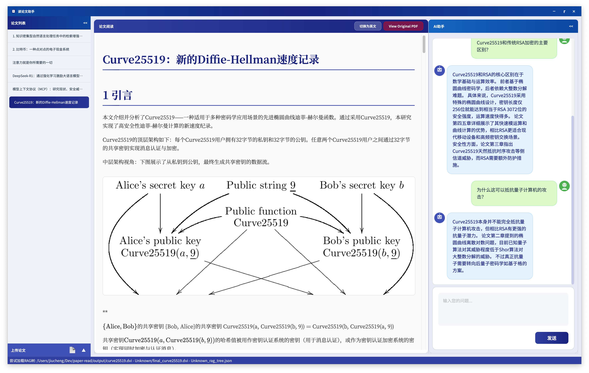
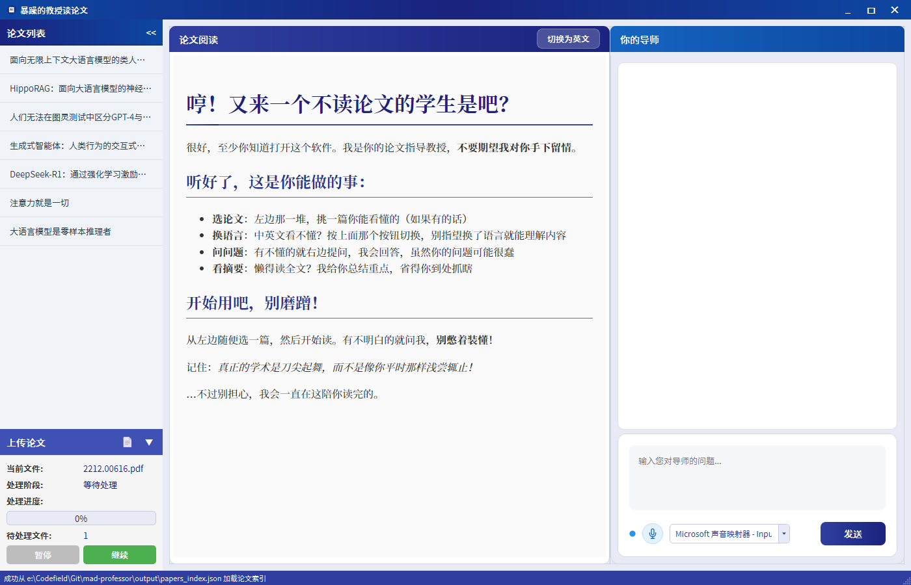

# AI论文助手（AI Paper Assister）

> 该项目是 LinYi's Team 的 mad-professor 的一个分支，主要用于个人论文阅读

**TODO LIST:**
- [x] 删除TTS功能减少项目复杂性，增加稳定性
- [x] 添加对MacOS的支持(MPS backend)
- [x] 添加快捷键（例如对于Vim-like的键位绑定）
- [x] 添加更多管理阅读PDF的功能
- [x] 将程序作为Package呈现
- [x] 固定使用Deepseek V3模型，增加API优惠时间提醒
- [x] 提供更便捷的论文文档管理功能（通过标记方式实现）
- [x] 添加归档功能，将已阅读的文章打包存储
- [ ] 增加不同的处理管线
- [ ] 添加聊天历史记录


## 安装指南

**具体参考原项目的安装指南（在底部）** 

1. 下载模型
   ```sh
   python download_models.py
   ```

2. 编辑`PaperCompanion/config.py`设置API密钥和模型路径，数据默认存放在`~/.ai-paper-assister-data`目录下

    ```py
    ...

    # API配置
    API_BASE_URL = "YOUR_API_URL"
    API_KEY = "YOUR_API_KEY"

    # 嵌入模型配置
    EMBEDDING_MODEL_NAME = "BAAI/bge-m3"

    # 数据存储路径
    BASE_DIR = os.path.expanduser("~/.ai-paper-assister-data")

    ...
    ```

3. 安装依赖 (按需生成需要venv环境)
    ```sh
    pip install -r requirements.txt
    ```

4. 1. 运行通过命令行
       ```sh
       python -m PaperCompanion.main
       ```

   2. 或者打包为.whl文件 (Recommended after running with cli)
       ```sh
       python -m build
       pipx install dist/PaperCompanion-0.1.0-py3-none-any.whl
       ```


***

>（以下为原README内容）

# 暴躁的教授读论文（mad-professor）
一个Python应用程序，特色是具有暴躁个性的AI教授，让学术论文阅读更加高效有趣。

## 项目概述

"暴躁教授读论文"是一个学术论文阅读伴侣应用程序，旨在通过富有个性的AI助手提高论文阅读效率。它集成了PDF处理、AI翻译、RAG检索、AI问答和语音交互等多种功能，为学术研究者提供一站式的论文阅读解决方案。



## 主要特性

- **论文自动处理**：导入PDF后自动提取、翻译和结构化论文内容
- **双语显示**：支持中英文对照阅读论文
- **AI智能问答**：与论文内容结合，提供专业的解释和分析
- **个性化AI教授**：AI以"暴躁教授"的个性回答问题，增加趣味性
- **语音交互**：支持语音提问和TTS语音回答
- **RAG增强检索**：基于论文内容的精准检索和定位
- **分屏界面**：左侧论文内容，右侧AI问答，高效交互

## 技术架构

- **前端界面**：PyQt6构建的现代化桌面应用
- **核心引擎**：
  - AI问答模块：基于LLM的学术问答系统
  - RAG检索系统：向量检索增强的问答精准度
  - 论文处理管线：PDF转MD、自动翻译、结构化解析
- **交互系统**：
  - 语音识别：实时语音输入识别
  - TTS语音合成：AI回答实时播报
  - 情感识别：根据问题内容调整回答情绪

## 安装指南

### 环境要求
- Python 3.10或更高版本
- CUDA支持
- 6GB 以上显存

### 项目依赖
本项目依赖以下开源项目
- MinerU https://github.com/opendatalab/MinerU
- RealtimeSTT https://github.com/KoljaB/RealtimeSTT

本项目依赖以下在线API服务（可以通过修改代码改为本地实现）
- DeepSeek https://api-docs.deepseek.com
- MiniMax https://platform.minimaxi.com/document/Voice%20Cloning?key=66719032a427f0c8a570165b

### 安装步骤
1. 使用conda创建环境
    ```
    conda create -n mad-professor python=3.10.16
    conda activate mad-professor
    ```
2. 安装MinerU依赖
    ```
    pip install -U magic-pdf[full]==1.3.3 -i https://mirrors.aliyun.com/pypi/simple
    ```

3. 安装剩余依赖
   ```
   pip install -r requirements.txt
   ```

4. 安装电脑显卡版本匹配的CUDA和torch, 要求numpy<=2.1.1，例（具体版本请按电脑配置修改，目前支持CUDA 11.8/12.4/12.6）：
    ```
    pip install --force-reinstall torch torchvision torchaudio "numpy<=2.1.1" --index-url https://download.pytorch.org/whl/cu124
    ```
    如果出现报错，请根据MinerU和RealtimeSTT开源项目中的CUDA依赖修改符合的torch和torchaudio版本

5. 安装FAISS的gpu版本 (注：faiss-gpu版本只能通过conda安装，无法通过pip安装)
    ```
    conda install -c conda-forge faiss-gpu
    ```
6. 模型下载
    ```
    python download_models.py
    ```
    python脚本会自动下载模型文件并配置好配置文件中的模型目录，配置文件可以在用户目录中找到，文件名为magic-pdf.json

    windows的【用户目录】为 "C:\Users\用户名", linux【用户目录】为 "/home/用户名"

    修改【用户目录】配置文件magic-pdf.json中"device-mode"的值来启用CUDA
    ```
    {
        "device-mode":"cuda"
    }
    ```
    语音输入的Whisper模型会在运行时自动下载

7. API密钥配置
   
   项目依赖LLM和TTS在线API服务

   通过修改`config.py`中的对应字段配置请求路径和密钥

    ```
    API_BASE_URL = "YOUR_API_URL"
    API_KEY = "YOUR_API_KEY"   
    ```
    按照DeepSeek官方文档配置 https://api-docs.deepseek.com

    ```
    TTS_GROUP_ID = "YOUR_MINIMAX_GROUP_ID"
    TTS_API_KEY = "YOUR_MINIMAX_API_KEY"
    ```
    按照MiniMax官方文档配置 https://platform.minimaxi.com/document/Voice%20Cloning?key=66719032a427f0c8a570165b

## 使用说明

### 教授人设/声音修改
目前人设和声音的修改只能通过手动修改代码实现

1. 人设prompt修改
   
    在`prompt`文件夹中创建一个新的`ai_character_prompt_[你的人设名字].txt`

    将`AI_professor_chat.py`程序开头`AI_CHARACTER_PROMPT_PATH`字段修改为相应的人设prompt路径
    ```
    AI_CHARACTER_PROMPT_PATH = "prompt/ai_character_prompt_[你的人设名字].txt"
    ```

    当前已有两个人设`ai_character_prompt_keli.txt`和`ai_character_prompt_leidian.txt`，可以作为示例


2.  声音修改
   
    按照MiniMax官方文档新建voice id，或使用现有voice id。官方文档：https://platform.minimaxi.com/document/Voice%20Cloning?key=66719032a427f0c8a570165b

    修改`TTS_manager.py`程序` TTSManager`类中`build_tts_stream_body`请求方法对应的voice_id参数
    ```
     body = json.dumps({
            "model": "speech-02-turbo",
            "text": text,
            "stream": True,
            "voice_setting": {
                "voice_id": "将这个参数修改为你想要使用的voice id",
                "speed": 1,
                "vol": 1,
                "pitch": 0,
                "emotion": mapped_emotion
            },
            "audio_setting": {
                "sample_rate": 32000,
                "bitrate": 128000,
                "format": "pcm",
                "channel": 1
            }
        })
    ```


### 启动应用
运行`main.py`

    python main.py

### 导入论文
1. 点击侧边栏的"导入论文"按钮
2. 选择PDF文件导入
3. 点击“继续”，等待处理完成（包括翻译和索引构建）
4. 导入的PDF会存放到data文件夹中，也可以将多篇PDF放入data文件夹，程序会检测未处理的文件批量处理

    

### 论文阅读
1. 在侧边栏选择已经处理好的论文
   
    

2. 在主窗口查看论文内容，右上角可切换中英文
   
    

3. 左右侧可折叠隐藏，提供沉浸式阅读体验

    

### AI问答与语音对话
1. 在对话窗口下方选择语音输入设备

    

2. 点击麦克风按钮，等指示灯变绿时开始对话
3. 如果说话时指示灯没有变黄，可能说明输入设备无法检测到人声，建议切换其他输入设备进行尝试

## 项目结构
```
mad-professor/
├── 核心模块
│   ├── AI_manager.py         # AI功能管理器，整合所有AI相关功能
│   ├── AI_professor_chat.py  # AI对话逻辑，实现暴躁教授的交互回答
│   ├── AI_professor_UI.py    # 主界面实现，应用程序的UI入口
│   ├── data_manager.py       # 数据管理器，处理论文索引和内容加载
│   ├── pipeline.py           # 处理管线，协调各处理器的工作流程
│   ├── rag_retriever.py      # RAG检索系统，实现向量检索和上下文提取
│   ├── TTS_manager.py        # TTS管理器，处理语音合成和播放
│   ├── voice_input.py        # 语音输入处理，实时语音识别
│   └── threads.py            # 线程管理，处理异步任务和并发
│
├── 用户界面组件 (ui/)
│   ├── chat_widget.py        # 聊天界面组件
│   ├── markdown_view.py      # Markdown渲染和显示组件
│   ├── message_bubble.py     # 消息气泡组件
│   ├── sidebar_widget.py     # 侧边栏组件（论文列表和上传）
│   └── upload_widget.py      # 文件上传组件
│
├── 处理器模块 (processor/)
│   ├── pdf_processor.py      # PDF处理器，提取PDF内容转为Markdown
│   ├── md_processor.py       # Markdown处理器，结构化解析Markdown
│   ├── json_processor.py     # JSON处理器，处理结构化数据
│   ├── tiling_processor.py   # 分块处理器，将内容分割为块
│   ├── translate_processor.py # 翻译处理器，中英文翻译
│   ├── md_restore_processor.py # Markdown还原处理器
│   ├── extra_info_processor.py # 额外信息处理器，生成摘要和问题
│   └── rag_processor.py      # RAG处理器，生成向量库和检索树
│
├── 提示词模板 (prompt/)
│   ├── ai_character_prompt_keli.txt    # 可莉教授人设提示词
│   ├── ai_character_prompt_leidian.txt # 雷电教授人设提示词
│   ├── ai_explain_prompt.txt           # 解释功能提示词
│   ├── ai_router_prompt.txt            # 路由决策提示词
│   ├── content_translate_prompt.txt    # 内容翻译提示词
│   ├── formula_analysis_prompt.txt     # 公式分析提示词
│   └── summary_generation_prompt.txt   # 摘要生成提示词
│
├── 资源和配置
│   ├── config.py             # 配置文件，API密钥和模型设置
│   ├── paths.py              # 路径管理，统一管理文件路径
│   ├── main.py               # 程序入口文件
│   ├── download_models.py    # 模型下载脚本
│   ├── assets/               # 资源文件目录（图片、样式等）
│   └── font/                 # 字体文件目录
│
└── 数据目录
    ├── data/                 # 源数据目录（论文PDF）
    └── output/               # 输出目录（处理结果）
```
## 已知问题

1. 本项目目前仅适用论文结构的PDF文档，对于非论文结构的文档可能报错/失效

2. 在音频输入设备未完成加载时激活麦克风按钮，再进行输入设备切换，可能会切换失败，激活麦克风按钮建议在音频设备完全加载后进行

3. 当前语音对话在外放时，AI教授的声音可能会被当做用户声音重复录入，建议使用耳机避免声音泄露

## 许可证

本项目采用 Apache 许可证 - 详情见 LICENSE 文件

## 致谢
特别感谢 MinerU 和 RealtimeSTT 项目
